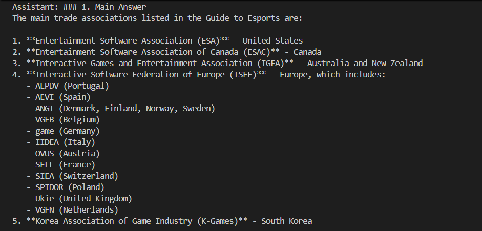
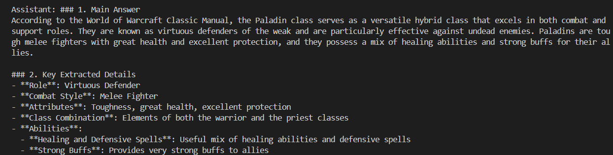
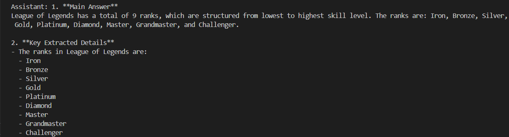

# REPORT.md

## Assigned Use Case

This project was built for the use case **Gaming Strategy and Esports Knowledge Bot**.

The objective was to create a RAG-based system that can answer questions from PDF documents related to:

- games
- esports strategy
- player roles
- mechanics
- competitive insights

---

## Documents Used

The following PDF documents were indexed for this project:

- **World of Warcraft Classic Manual**
- **Warcraft III Manual**
- **Sid Meier’s Civilization V Quick Start Manual**
- **NBA 2K24 Online Manual**
- **Identifying Strategies of eSports Players at Various Proficiency Levels in League of Legends**
- **Guide to Esports**
- **Esports Industry Report (Pillsbury)**
- **ALGS Official Rules**

These documents were selected to cover different parts of the use case such as player roles, game mechanics, strategy, and esports ecosystem knowledge.

---

## Changes Made in Prompts and Settings

### Prompt Changes
Initially, the prompts were too summary-based. Because of that, the system sometimes gave vague answers even when the correct chunk had been retrieved, especially for table-based content.

To improve this, the prompts were updated so that the model:
- extracts information from both **paragraphs** and **tables/lists**
- lists exact items when available
- avoids replacing factual entries with generic summaries
- stays grounded in retrieved content only

### Settings Tested

**Baseline**
- Chunk size = 1000
- Chunk overlap = 200
- Retrieval k = 4

**Experiment 2: Retrieval Tuning**
- Chunk size = 1000
- Chunk overlap = 200
- Retrieval k = 6

**Experiment 3: Chunking Tuning**
- Chunk size = 600
- Chunk overlap = 150
- Retrieval k = 4

---

## Test Questions

The following three questions were used as the main domain-specific tests:

1. **What are the main trade associations listed in the Guide to Esports?**
2. **According to the World of Warcraft Classic Manual, what is the role of the Paladin class?**
3. **How many ranks does League of Legends have?**

---

## Outputs / Screenshots

### Test Question 1
**Question:** What are the main trade associations listed in the Guide to Esports?

**Output Summary:**  
After prompt tuning, the system correctly extracted and listed the trade associations from the table in the PDF.

**Screenshot:**  

---

### Test Question 2
**Question:** According to the World of Warcraft Classic Manual, what is the role of the Paladin class?

**Output Summary:**  
The system correctly described the Paladin as a hybrid class with defensive, healing, and support abilities.

**Screenshot:**  

---

### Test Question 3
**Question:** How many ranks does League of Legends have?

**Output Summary:**  
The system correctly answered that League of Legends has 9 ranks.

**Screenshot:**  

---

## What Worked Well

- The system worked well for **specific and focused questions**.
- Prompt tuning improved extraction from **table-based content**.
- Questions related to a single class, rule, or fact gave better answers.
- The gaming/esports specialist structure helped organize the responses effectively.

---

## What Did Not Work Well

- Broad questions sometimes gave **incomplete answers**.
- Some exact facts in the PDFs were missed because the relevant chunk was not always retrieved.
- Smaller chunk settings did not improve the overall performance for this document set.
- Table-heavy content required better prompt design to be handled properly.

---

## Experiment Summary

### Experiment 1: Prompt / Generation Tuning
With the baseline settings, the system retrieved the correct trade association chunk but initially failed to list the table entries properly. After updating the prompts to extract from both paragraphs and tables/lists, the answer improved significantly.

### Experiment 2: Retrieval Tuning
Increasing retrieval `k` from 4 to 6 improved the breadth of retrieved context, but broad questions still did not always return complete coverage. Narrow questions performed better.

### Experiment 3: Chunking Tuning
Reducing chunk size to 600 and overlap to 150 helped some narrow factual questions, but overall the results were less stable than the baseline. The baseline chunking settings preserved context better for this corpus.

---

## Final Conclusion

This project successfully adapted the RAG architecture to the **Gaming Strategy and Esports Knowledge Bot** use case.

The best-performing setup for this document set was:

- **Chunk size = 1000**
- **Chunk overlap = 200**
- **Retrieval k = 4**

The most important improvement came from **prompt tuning**, especially for handling both paragraph text and table-based content. Overall, the project showed that both retrieval quality and prompt design are important for producing grounded and accurate answers in a RAG system.